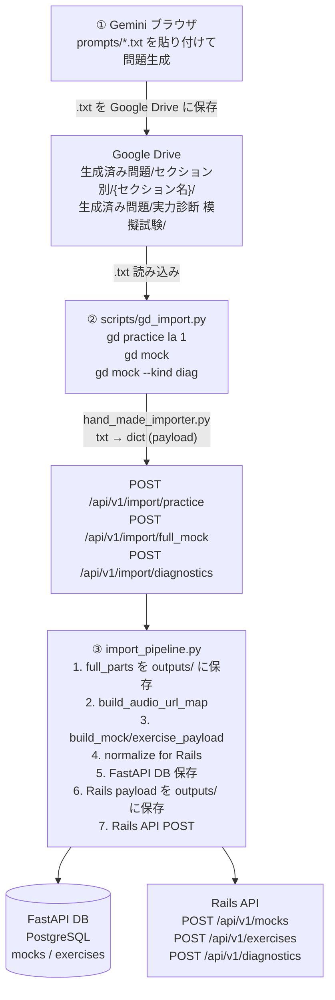
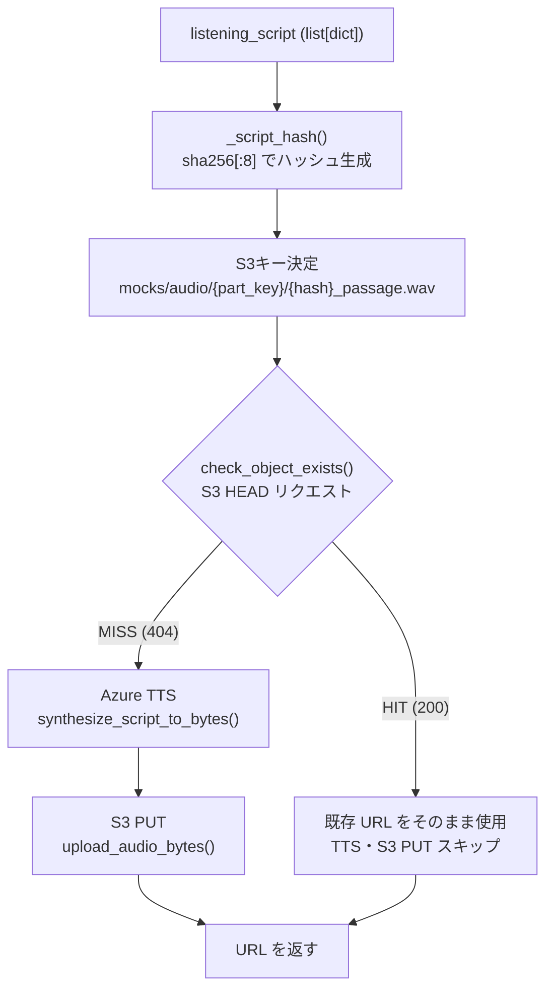
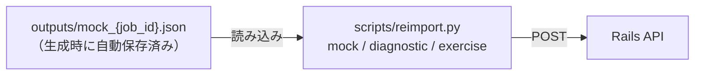
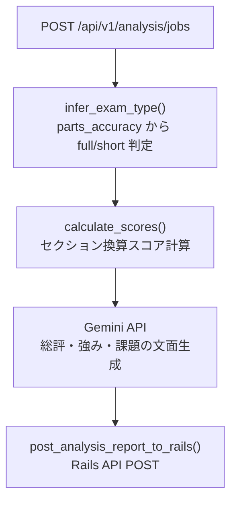

# システムアーキテクチャ・処理フロー

## 前提

- 問題生成は **Gemini ブラウザ上で手動実行** している
- OpenAI / ChatGPT API は現時点で使用していない（`app/workers/generation_tasks.py` は未使用コードとして存在）
- 生成した問題は txt ファイルとして Google Drive に保存し、スクリプト経由で投入する

---

## 全体フロー



---

## 音声生成フロー（build_audio_url_map）

Listening パートのみ実行される。



---

## Rails DB削除時の再投入フロー

S3・TTS・Gemini は一切不要。



コマンド一覧:

```bash
python scripts/reimport.py mock       <job_id>              # 模擬試験
python scripts/reimport.py diagnostic <job_id>              # 実力診断
python scripts/reimport.py exercise   <part_type> <job_id>  # セクション別
```

---

## 分析レポートフロー

問題投入とは独立した同期処理。



---

## 主要ファイル構成

```
FastAPI/
├── app/
│   ├── api/v1/
│   │   ├── import_content.py   # 手動投入エンドポイント (現在の主要入口)
│   │   ├── generation.py       # 自動生成エンドポイント (未使用)
│   │   ├── mocks.py            # Mock CRUD
│   │   ├── exercises.py        # Exercise CRUD
│   │   └── analysis.py         # 分析レポート
│   ├── services/
│   │   ├── hand_made_importer.py        # txt → payload 変換
│   │   ├── generation/
│   │   │   ├── import_pipeline.py       # TTS→S3→DB→Rails の中核
│   │   │   ├── audio_upload.py          # S3キャッシュ付き音声アップロード
│   │   │   └── payload_builder.py       # Mock/Exercise スキーマ組み立て
│   │   ├── speech/azure_speech.py       # Azure TTS
│   │   └── storage/s3_client.py         # S3 upload / existence check
│   ├── workers/
│   │   └── generation_tasks.py          # Celery タスク (未使用)
│   └── db/models.py                     # PostgreSQL テーブル定義
├── scripts/
│   ├── gd_import.py    # Google Drive → FastAPI 投入（メインの投入スクリプト）
│   ├── hand_made.py    # ローカル hand_made/ ディレクトリからの投入
│   └── reimport.py     # Rails DB削除後の再投入
├── prompts/            # Gemini に渡すプロンプト (.txt)
└── outputs/            # 生成済み Rails payload のバックアップ
```

---

## 環境変数

| 変数名 | 用途 |
|--------|------|
| `CONTENT_SOURCE_API_KEY` | FastAPI Bearer 認証 |
| `AZURE_SPEECH_KEY` | Azure TTS 認証 |
| `AZURE_SPEECH_REGION` | Azure TTS リージョン |
| `AWS_ACCESS_KEY_ID` | S3 認証 |
| `AWS_SECRET_ACCESS_KEY` | S3 認証 |
| `S3_BUCKET` | S3 バケット名 |
| `S3_REGION` | S3 リージョン |
| `RAILS_API_BASE_URL` | Rails 送信先 |
| `RAILS_API_KEY` | Rails Bearer 認証 |
| `DATABASE_URL` | PostgreSQL 接続先 |
